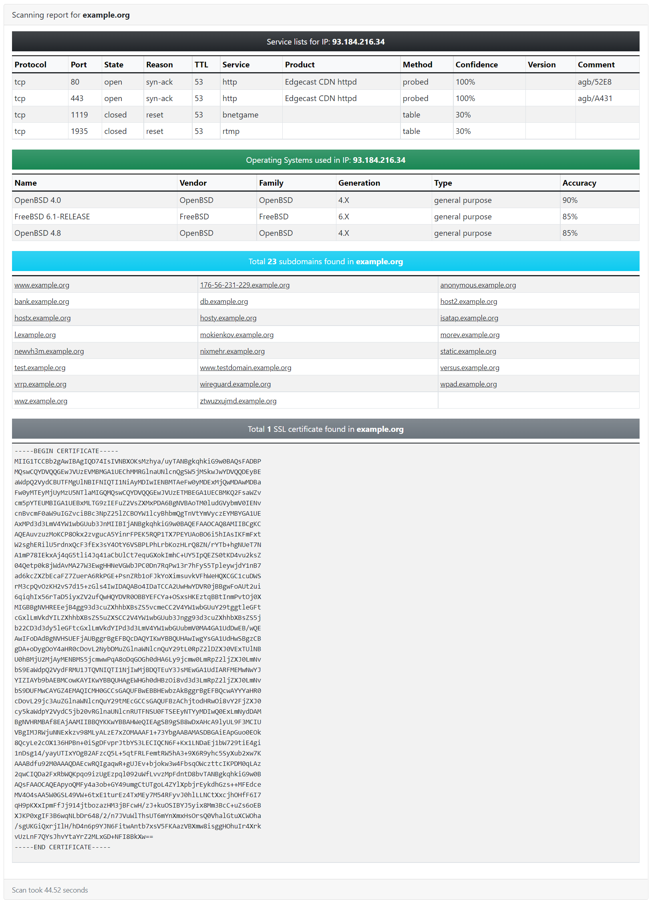

# CBPen

Cloud Blazers Penetration Testing Tool



### Project checklist

&check; Must provide a web based or mobile app based interface.

&check; User enters a range of IP addresses to scan, and selects from many different scanning options.

&cross; The cloud based server/monitor then splits the IP address ranges and distributes the task across multiple (at
least 3) virtual machines, SQS can be used to send the tasks to the scanner virtual machines.

&check; Each of the scanner virtual machines performs a scan for the range of IP addresses given and sends the scan
result back to the monitor.

&check; The monitor combines reports from multiple scanners and prepares a central report.

&cross; Must support multiple concurrent users and require user authentication.

### Features

- Scan top ports
- Scan services
- Scan operating systems
- List subdomains
- Scan SSL certificates
- Parallel execution of scanning in multiple VMs that increase the screening speed multiple times

### Execution time comparision

Comparision between parallel and non parallel execution time. The time is measured in seconds.

| Scan type | Number of sites | Parallel execution time | Non parallel execution time |
| --- | --- | --- | --- |
| Port | 6 | 3.29 | 11.93 |
| Services and operating systems | 6 | 39.88 | 161.02 |
| Subdomains and SSL certificates | 6 | 30.27 | 87.58 |

## Local Setup

### Requirements

- Python 3
- Pip
- nmap:
  Windows users, please download and
  install [latest stable release self-installer nmap-7.92-setup.exe](https://nmap.org/dist/nmap-7.92-setup.exe)
- Internet connection

### Install dependencies

- Clone the repository.
- Open a terminal / powershell in the cloned repository.
- Create a virtual environment and activate it. If you are using Linux / Mac:

```commandline
python3 -m venv venv
source venv/bin/activate
```

Create and activate `venv` in Windows (Tested in Windows 10):

```commandline
python -m venv venv
Set-ExecutionPolicy -ExecutionPolicy RemoteSigned -Scope CurrentUser
.\venv\Scripts\Activate.ps1
```

After activate the terminal / powershell will have `(venv)` added to the prompt.

- Check `pip` version:

```commandline
pip --version
```

It should point to the `pip` in the activated `venv`.

- Install required packages:

```commandline
pip install -r requirements.txt
```

### Run the project

- Activate the `venv` if not activated:
  Linux / Mac:

```commandline
source venv/bin/activate
```

Windows:

```commandline
.\venv\Scripts\Activate.ps1
```

- To run the project call `flask run` command. It will invoke the environment variables which are set
  in [.flaskenv](./.flaskenv) file:

```commandline
flask run
```

## Cloud Setup

### Requirements

- Docker
- Docker compose

### Run the project

- Run the project using the following command:

```commandline
docker-compose build --no-cache
docker-compose up --force-recreate
```

- Access the web application from: [http://localhost:5000/](http://localhost:5000/)
- Down the project:

```commandline
docker-compose down
```

### Clean docker

- Check the running images:

```commandline
docker ps -a
```

- Remove any stopped containers and all unused images:

```commandline
docker system prune -a
```

### Clean package list

- List currently installed packages in a file:

```commandline
pip freeze > uninstall.txt
```

- Uninstall everything recursively:

```commandline
pip uninstall -r uninstall.txt -y
```

- Delete the uninstalled package list file:

```commandline
rm uninstall.txt
```

- Install everything recursively:

```commandline
pip install -r requirements.txt
```

### Sample of getting JSON API response:

- Get ports information of "example.com" or an IP:

```commandline
http://127.0.0.1:5000/ports?site=example.com
http://127.0.0.1:5000/ports?site=93.184.216.34
```

- Get service information of "example.com" or an IP:

```commandline
http://127.0.0.1:5000/services?site=example.com
http://127.0.0.1:5000/services?site=93.184.216.34
```

- Get subdomain and SSL information of "example.com" (No IP address is allowed):

```commandline
http://127.0.0.1:5000/subdomains?site=example.com
```

### Reference

- [Docker compose tutorial](https://docs.docker.com/compose/gettingstarted/)
- [How To Remove Docker Images, Containers, and Volumes](https://www.digitalocean.com/community/tutorials/how-to-remove-docker-images-containers-and-volumes)
- [Writing a Basic Port Scanner in Python](https://westoahu.hawaii.edu/cyber/forensics-weekly-executive-summmaries/writing-a-basic-port-scanner-in-python/)
- [Icons class in template](https://icons.getbootstrap.com/)
- [Virtual environments for Flask app](https://flask.palletsprojects.com/en/2.0.x/installation/#virtual-environments)
- [Python3 nmap package](https://pypi.org/project/python3-nmap/)
- [Python nmap package](https://pypi.org/project/python-nmap/)
- [Latest stable release self-installer nmap-7.92-setup.exe](https://nmap.org/dist/nmap-7.92-setup.exe)
- [Sublist3r package](https://github.com/aboul3la/Sublist3r)
- [sslyze documentation](https://nabla-c0d3.github.io/sslyze/documentation/available-scan-commands.html#id15)
- [Requests future package](https://pypi.org/project/requests-futures/)
- [Jinja template documentation](https://jinja.palletsprojects.com/en/3.0.x/templates/#if-expression)