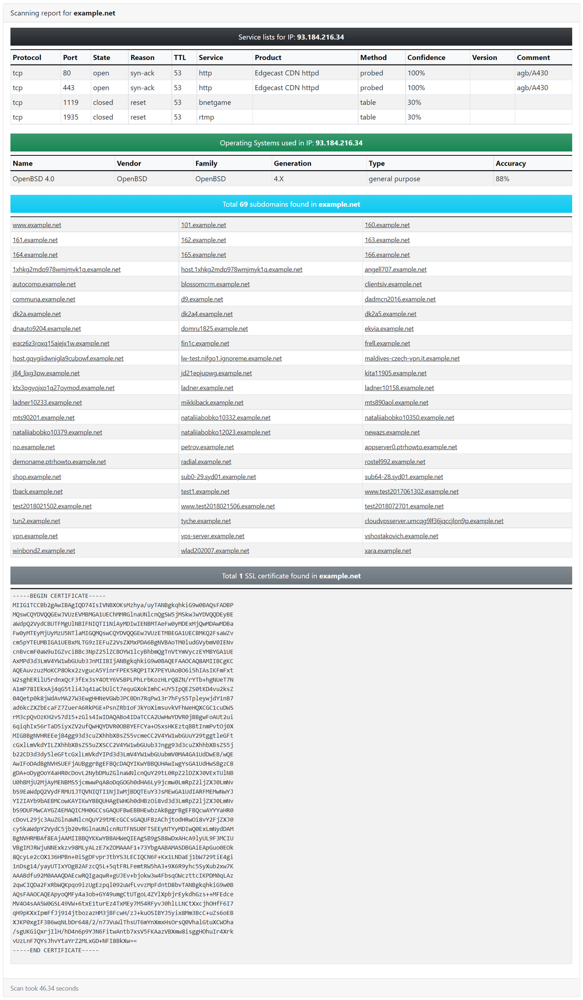

# CBPen

Cloud Blazers Penetration Testing Tool



## Local Setup

### Requirements

- Python 3
- Pip
- nmap:
  Windows users, please download and
  install [latest stable release self-installer nmap-7.92-setup.exe](https://nmap.org/dist/nmap-7.92-setup.exe)
- Internet connection

### Install dependencies

- Clone the repository.
- Open a terminal / powershell in the cloned repository.
- Create a virtual environment and activate it. If you are using Linux / Mac:

```commandline
python3 -m venv venv
source venv/bin/activate
```

Create and activate `venv` in Windows (Tested in Windows 10):

```commandline
python -m venv venv
Set-ExecutionPolicy -ExecutionPolicy RemoteSigned -Scope CurrentUser
.\venv\Scripts\Activate.ps1
```

After activate the terminal / powershell will have `(venv)` added to the prompt.

- Check `pip` version:

```commandline
pip --version
```

It should point to the `pip` in the activated `venv`.

- Install required packages:

```commandline
pip install -r requirements.txt
```

### Run the project

- Activate the `venv` if not activated:
  Linux / Mac:

```commandline
source venv/bin/activate
```

Windows:

```commandline
.\venv\Scripts\Activate.ps1
```

- To run the project call `flask run` command. It will invoke the environment variables which are set
  in [.flaskenv](./.flaskenv) file:

```commandline
flask run
```

## Cloud Setup

### Requirements

- Docker
- Docker compose

### Run the project

- Run the project using the following command:

```commandline
docker-compose build --no-cache
docker-compose up --force-recreate
```

- Access the web application from: [http://localhost:5000/](http://localhost:5000/)
- Down the project:

```commandline
docker-compose down
```

### Clean docker

- Check the running images:

```commandline
docker ps -a
```

- Remove any stopped containers and all unused images:

```commandline
docker system prune -a
```

### Clean package list

- List currently installed packages in a file:

```commandline
pip freeze > uninstall.txt
```

- Uninstall everything recursively:

```commandline
pip uninstall -r uninstall.txt -y
```

- Delete the uninstalled package list file:

```commandline
rm uninstall.txt
```

- Install everything recursively:

```commandline
pip install -r requirements.txt
```

### Features

- Scan top ports
- Scan services
- Scan operating systems
- List subdomains
- Scan SSL certificates

### Reference

- [Docker compose tutorial](https://docs.docker.com/compose/gettingstarted/)
- [How To Remove Docker Images, Containers, and Volumes](https://www.digitalocean.com/community/tutorials/how-to-remove-docker-images-containers-and-volumes)
- [Writing a Basic Port Scanner in Python](https://westoahu.hawaii.edu/cyber/forensics-weekly-executive-summmaries/writing-a-basic-port-scanner-in-python/)
- [Icons class in template](https://icons.getbootstrap.com/)
- [Virtual environments for Flask app](https://flask.palletsprojects.com/en/2.0.x/installation/#virtual-environments)
- [Python3 nmap package](https://pypi.org/project/python3-nmap/)
- [Python nmap package](https://pypi.org/project/python-nmap/)
- [Latest stable release self-installer nmap-7.92-setup.exe](https://nmap.org/dist/nmap-7.92-setup.exe)
- [Sublist3r package](https://github.com/aboul3la/Sublist3r)
- [sslyze documentation](https://nabla-c0d3.github.io/sslyze/documentation/available-scan-commands.html#id15)